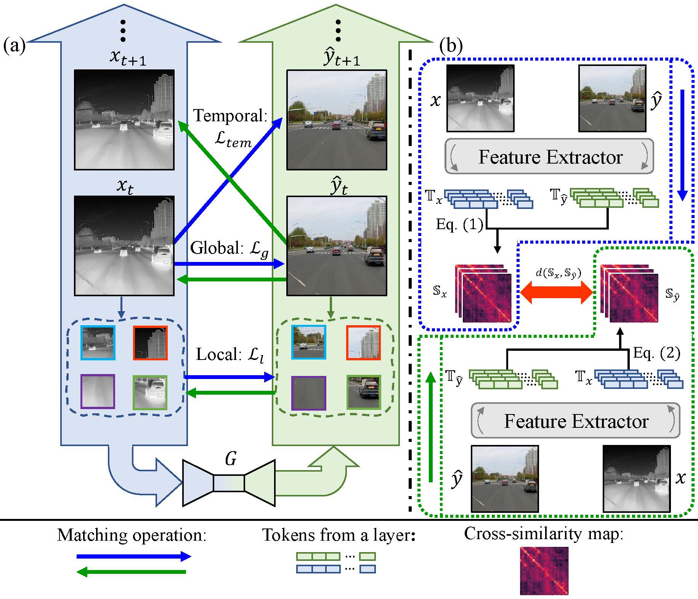

# ROMA
This repository is the official Pytorch implementation for ACM MM'22 paper
"ROMA: Cross-Domain Region Similarity Matching for Unpaired Nighttime Infrared to Daytime Visible Video Translation".[[Arxiv]](https://arxiv.org/abs/2204.12367)

**Examples of Object Detection:**


**Examples of Video Fusion**


More experimental results can be obtained by contacting us.

# Introduction

## Method


- The domain gaps between unpaired nighttime infrared and daytime visible videos are even huger than paired ones that captured at the same time, establishing an effective translation mapping will greatly contribute to various fields.
- Our proposed cross-similarity, which are calculated across domains, could make the generative process focus on learning the content of structural correspondence between real and synthesized frames, getting rid of the negative effects of different styles.


## Training
The following is the required structure of dataset. For the video mode, the input of a single data is the result of concatenating **two adjacent frames**; for the image mode, the input of a single data is **a single image**.
```
Video/Image mode:
  trainA: \Path\of\trainA
  trainB: \Path\of\trainB

```
Concrete examples of the training and testing are shown in the script files `./scripts/train.sh` and `./scripts/test.sh`, respectively.


## InfraredCity and InfraredCity-Lite Dataset


<table class="tg">
<thead>
  <tr>
    <th class="tg-uzvj" colspan="2">InfraredCity</th>
    <th class="tg-uzvj" colspan="4">Total Frame</th>
  </tr>
</thead>
<tbody>
  <tr>
    <td class="tg-9wq8" colspan="2">Nighttime Infrared</td>
    <td class="tg-9wq8" colspan="4">201,856</td>
  </tr>
  <tr>
    <td class="tg-9wq8" colspan="2">Nighttime Visible</td>
    <td class="tg-9wq8" colspan="4">178,698</td>
  </tr>
  <tr>
    <td class="tg-9wq8" colspan="2">Daytime Visible</td>
    <td class="tg-9wq8" colspan="4">199,430</td>
  </tr>
  <tr>
    <td class="tg-9wq8" colspan="6"></td>
  </tr>
  <tr>
    <td class="tg-uzvj" colspan="2">InfraredCity-Lite</td>
    <td class="tg-uzvj">Infrared<br>Train</td>
    <td class="tg-uzvj">Infrared<br>Test</td>
    <td class="tg-uzvj">Visible<br>Train</td>
    <td class="tg-uzvj">Total</td>
  </tr>
  <tr>
    <td class="tg-9wq8" rowspan="2">City</td>
    <td class="tg-9wq8">clearday</td>
    <td class="tg-9wq8">5,538</td>
    <td class="tg-9wq8">1,000</td>
    <td class="tg-9wq8" rowspan="2">5360</td>
    <td class="tg-9wq8" rowspan="2">15,180</td>
  </tr>
  <tr>
    <td class="tg-9wq8">overcast</td>
    <td class="tg-9wq8">2,282</td>
    <td class="tg-9wq8">1,000</td>
  </tr>
  <tr>
    <td class="tg-9wq8" rowspan="2">Highway</td>
    <td class="tg-9wq8">clearday</td>
    <td class="tg-9wq8">4,412</td>
    <td class="tg-9wq8">1,000</td>
    <td class="tg-9wq8" rowspan="2">6,463</td>
    <td class="tg-9wq8" rowspan="2">15,853</td>
  </tr>
  <tr>
    <td class="tg-9wq8">overcast</td>
    <td class="tg-9wq8">2,978</td>
    <td class="tg-9wq8">1,000</td>
  </tr>
  <tr>
    <td class="tg-9wq8" colspan="2">Monitor</td>
    <td class="tg-9wq8">5,612</td>
    <td class="tg-9wq8">500</td>
    <td class="tg-9wq8">4,194</td>
    <td class="tg-9wq8">10,306</td>
  </tr>
</tbody>
</table>

The datasets and their more details are available in [InfiRay](http://openai.raytrontek.com/apply/Infrared_city.html/).


### Citation
If you find our work useful in your research or publication, please cite our work:
```
@inproceedings{ROMA2022,
  title     = {ROMA: Cross-Domain Region Similarity Matching for Unpaired Nighttime Infrared to Daytime Visible Video Translation},
  author    = {Zhenjie Yu and Kai Chen and Shuang Li and Bingfeng Han and Chi Harold Liu and Shuigen Wang},
  booktitle = {ACM MM},
  pages     = {5294--5302},
  year      = {2022}
}
```

#### Acknowledgements
This code borrows heavily from the PyTorch implementation of [Cycle-GAN and Pix2Pix](https://github.com/junyanz/pytorch-CycleGAN-and-pix2pix) and [CUT](https://github.com/taesungp/contrastive-unpaired-translation).  
A huge thanks to them!
```
@inproceedings{CycleGAN2017,
  title     = {Unpaired Image-to-Image Translation using Cycle-Consistent Adversarial Networkss},
  author    = {Zhu, Jun-Yan and Park, Taesung and Isola, Phillip and Efros, Alexei A},
  booktitle = {ICCV},
  year      = {2017}
}

@inproceedings{CUT2020,
  author       = {Taesung Park and Alexei A. Efros and Richard Zhang and Jun{-}Yan Zhu},
  title        = {Contrastive Learning for Unpaired Image-to-Image Translation},
  booktitle    = {ECCV},
  pages        = {319--345},
  year         = {2020},
}
```